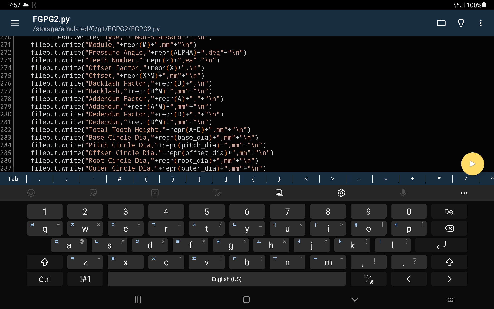
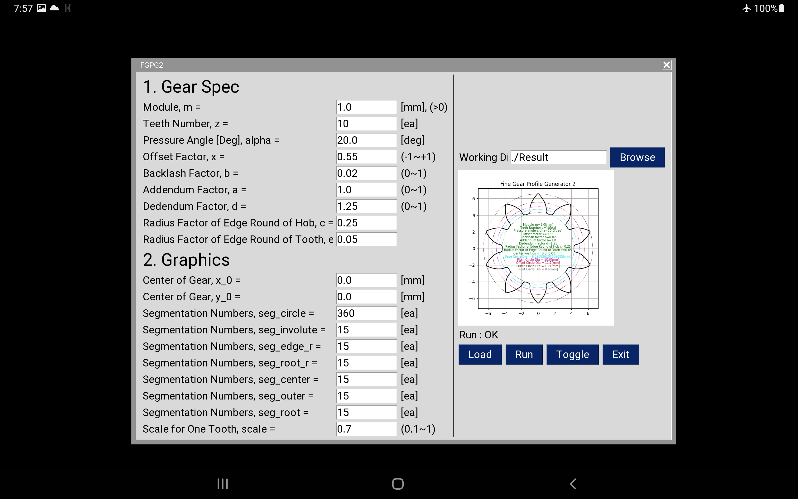
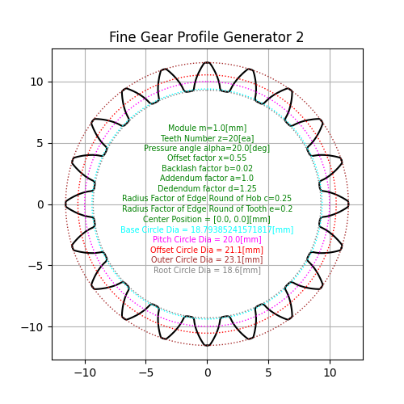
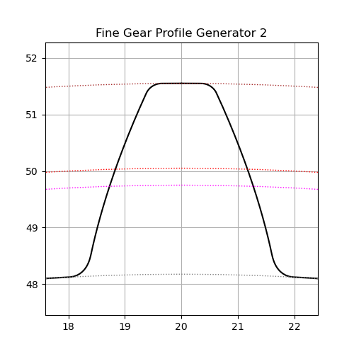

# FGPG2

_Fine Involute Gear Profile Generator 2_

_with python3_


## Using on PC

* Install python3, git
* Install some libraries :

```
pip install numpy
pip install matplotlib
pip install ezdxf
pip install pysimplegui
```
* Clone this repository
* Run :

```
python FGPG2.py
```

## Build exe in MS Windows 10

* Development version of pyinstaller is needed because of matplotlib matching

```
pip install https://github.com/pyinstaller/pyinstaller/archive/develop.zip
pyinstaller -w -F FGPG2.py
```

## Using on Android by Pydroid3

* Install Pydroid3
* Install some libraries by Pip menu in Pydroid (numpy, matplotlib, ezdxf, pysimplegui)
* Install mgit
* Clone this repository
* Load FGPG2.py and run






## UI Buttons

* __Working Directory__ : Output files are saved here.
* __Load__ : Load Inputs.dat and every parameters are set.
* __Run__ : Calculate, Plot, Save plotted images, Save dxf, Save csv
* __Toggle__ : Change output image
* __Exit__ : Finish

## Input parameters

* __m__ : Module
* __z__ : Teeth number
* __alpha__ : Pressure angle
* __x__ : Offset factor
* __b__ : Backlash factor
* __a__ : Addendum factor
* __d__ : Dedendum factor
* __c__ : Radius factor of edge round of hob (root)
* __e__ : Radius factor of edge round of tooth (edge)
* __x0__ : Center position
* __y0__ : Center position
* __seg circle__ : Number of contol points for pitch, offset and base circles
* __seg involute__ : Number of contol points for involute curve
* __seg edge r__ : Number of contol points for edge trocoid rounding
* __seg root r__ : Number of contol points for root trocoid rounding
* __seg outer__ : Number of contol points for outer arc
* __seg root__ : Number of contol points for root arc
* __scale__ : Scale factor for one tooth plot

## Output files

* __Inputs.dat__ : Parameters data for UI
* __Result.csv__ : Gear spec data
* __Result.dxf__ : dxf CAD file for one tooth
* __Result.png__ : Gear geometry for whole teeth



* __Result2.png__ : Gear geometry for one tooth




