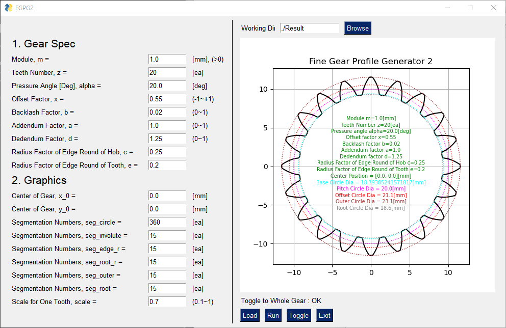
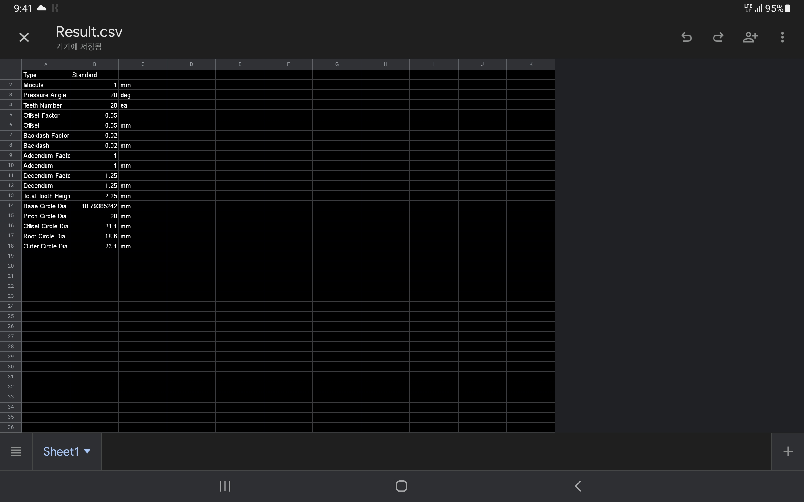
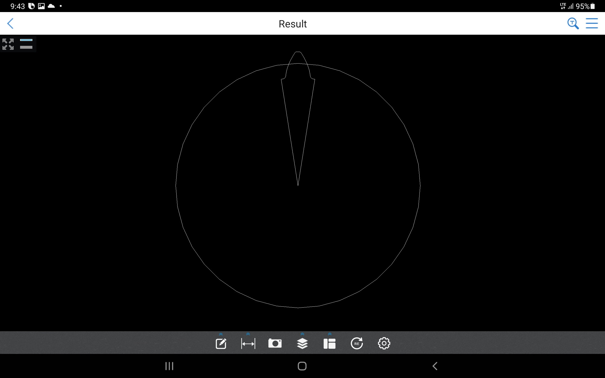
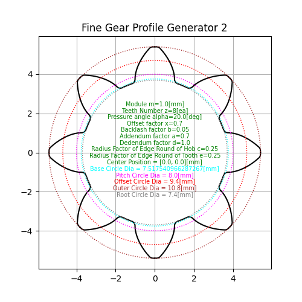
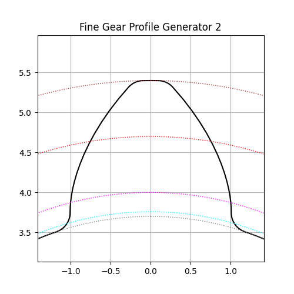

# FGPG2

_Fine Involute Gear Profile Generator 2 - with python3_


## Using on PC

* Install python3 and git
* Install some libraries :

```
conda install numpy matplotlib ezdxf pysimplegui
```
* Clone this repository by git
* Run :

```
python FGPG2.py
```




## Build exe in MS Windows 11

* Development version of pyinstaller is needed because of matplotlib matching issue.

```
pip install https://github.com/pyinstaller/pyinstaller/archive/develop.zip
pyinstaller --icon=FGPG2.ico -w -F FGPG2.py
copy .\FGPG2.png .\dist\FGPG2.png 
```


## Using on Android Device by Pydroid3

* Install [Pydroid3](https://play.google.com/store/apps/details?id=ru.iiec.pydroid3&hl=ko&gl=US) in PlayStore
* Install some libraries by Pip menu in Pydroid3 (numpy, matplotlib, ezdxf, pysimplegui)
* Install [mgit](https://play.google.com/store/apps/details?id=com.manichord.mgit&hl=ko&gl=US) in PlayStore
* Clone this repository
* Load FGPG2.py and run


## Using on Linux

* **Anaconda3** has Tk font problem.
* In **pyenv** Environment

```bash
pyenv install 3.11.3
pyenv global 3.11.3

pip install numpy
pip install matplotlib
pip install ezdxf
pip install pysimplegui

python FGPG2.py
```


## UI Buttons

* __Working Directory__ : Output files are saved here.
* __Load__ : Load Inputs.dat and every parameters are set.
* __Run__ : Calculate, Plot, Save plotted images, Save dxf, Save csv
* __Toggle__ : Change output image
* __Exit__ : Finish


## Input parameters

* __m__ : Module
* __z__ : Teeth number
* __alpha__ : Pressure angle
* __x__ : Offset factor
* __b__ : Backlash factor
* __a__ : Addendum factor
* __d__ : Dedendum factor
* __c__ : Radius factor of edge round of hob (root)
* __e__ : Radius factor of edge round of tooth (edge)
* __x0__ : Center position
* __y0__ : Center position
* __seg circle__ : Number of contol points for pitch, offset and base circles
* __seg involute__ : Number of contol points for involute curve
* __seg edge r__ : Number of contol points for edge trocoid rounding
* __seg root r__ : Number of contol points for root trocoid rounding
* __seg outer__ : Number of contol points for outer arc
* __seg root__ : Number of contol points for root arc
* __scale__ : Scale factor for one tooth plot


## Output files

* __Inputs.dat__ : Parameters data for UI
* __Result.csv__ : Gear spec data



* __Result.dxf__ : dxf CAD file for one tooth



* __Result.png__ : Gear geometry for whole teeth



* __Result2.png__ : Gear geometry for one tooth



## Ref.

* [Calculate Gear Spec](https://tro.kr/11) : Excel Sheet
* [Calculate Gear Spec](https://tro.kr/49) : Web


## Thank you!
