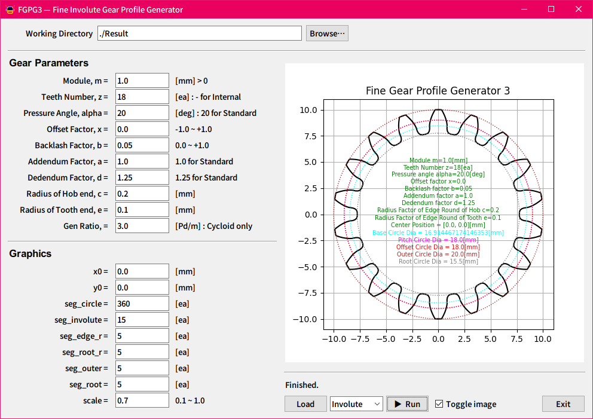
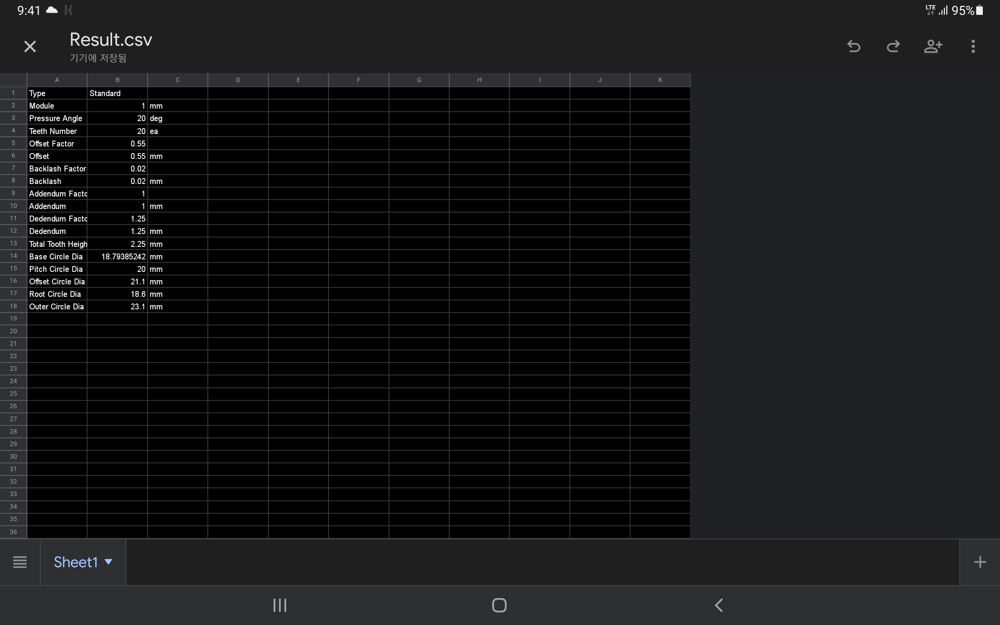
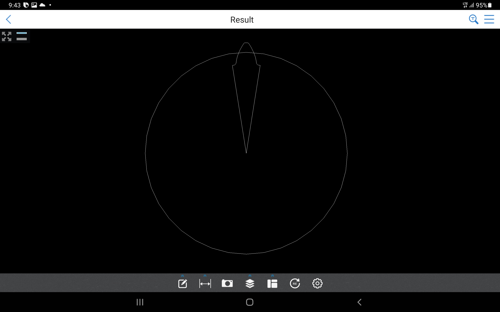
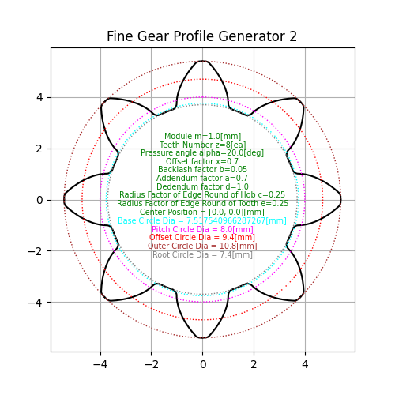
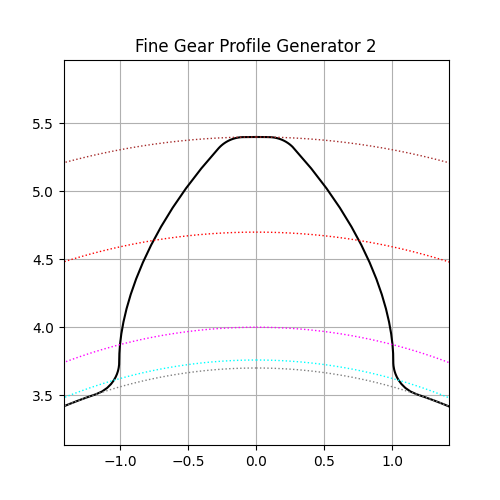

# FGPG2

_Fine Involute & Cycloid Gear Profile Generator - with python3_and uv package manager_





## UI Buttons

* __Working Directory__ : Output files are saved here.
* __Load__ : Load Inputs.csv and every parameters are set.
* __Profile Combo Box__ (between Load and Run) : Select __Involute__ or __Cycloid__ gear profile.
* __Run__ : Calculate, Plot, Save plotted images, Save dxf, Save csv
* __Toggle__ : Change output image
* __Exit__ : Finish


## Input parameters

* __m__ : Module
* __z__ : Teeth number (negative selects an internal gear)
* __alpha__ : Pressure angle (involute only)
* __x__ : Offset factor
* __b__ : Backlash factor
* __a__ : Addendum factor
* __d__ : Dedendum factor
* __c__ : Radius factor of edge round of hob (root)
* __e__ : Radius factor of edge round of tooth (edge)
* __gen_ratio__ : Rolling-circle diameter / module (Pd/m, cycloid only)
* __x0__ : Center position
* __y0__ : Center position
* __seg circle__ : Number of control points for pitch, offset and base circles
* __seg involute__ : Number of control points for involute (or cycloid flank) curve
* __seg edge r__ : Number of control points for edge trochoid rounding
* __seg root r__ : Number of control points for root trochoid rounding
* __seg outer__ : Number of control points for outer arc
* __seg root__ : Number of control points for root arc
* __scale__ : Scale factor for one tooth plot


## Output files

* __Inputs.csv__ : Parameters data for UI
* __Result.csv__ : Gear spec data (Type = Standard/Non-Standard/Cycloid)



* __Result.dxf__ : dxf CAD file for one tooth



* __Result1.png__ : Gear geometry for whole teeth



* __Result2.png__ : Gear geometry for one tooth




## Command Line

Generate the gear without launching the GUI:

```sh
python FGPG2_CLI.py <path/to/Results.csv> [involute|cycloid]
```

* The input CSV uses the same two-column `parameter,value` format as `Inputs.csv`.
* The optional second argument selects the gear profile and overrides the CSV's `profile` row.
* Output files (`Result.csv`, `Result.dxf`, `Result1.png`, `Result2.png`) are written into the same directory as the input CSV.


## Ref.

* [Calculate Gear Spec](https://tro.kr/11) : Excel Sheet
* [Calculate Gear Spec](https://tro.kr/49) : Web


## Thank you!
